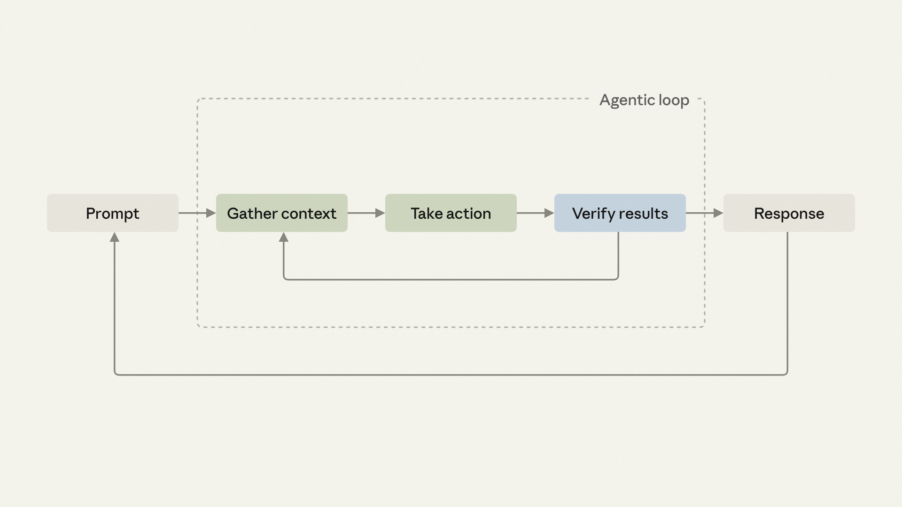

> **In here:** what a verification loop is · built-in Claude Code verification (/verify, toolchain, Code Review, GitHub Actions, spec validation, rubrics) · writing and chaining verification skills

# Building verification loops in Claude Code with skills

**Author:** Delba de Oliveira
**Date:** July 22, 2026
**Reading time:** 5 min
**Category:** Claude Code
**Product:** Claude Code

---

## Introduction

Most agentic coding sessions follow a predictable pattern: request changes, gather context, execute actions, verify results, and iterate if needed. Verification represents how agents validate their work before responding. While Claude leverages deterministic signals like type checkers, linters, tests, and runtime errors, manual verification steps can be systematized into reusable loops.

In Claude Code, "a verification loop is an iterative process where Claude checks and attempts to fix the work."



---

## What is a verification loop?

A verification loop creates a repeating cycle where an AI agent examines its own output—running tests, linters, or custom checks—and corrects failures before proceeding. In Claude Code, these loops can be packaged as skills, ensuring consistent application across all sessions.

---

## Built-in verification loops

Claude provides native support for several verification approaches:

- **/verify skill**: Builds, runs, and observes application changes
- **Toolchain**: Claude catches error codes and warnings from tools; list build and test commands in CLAUDE.md
- **Code Review (research preview)**: Automated PR review service with @claude integration
- **GitHub Actions**: Define jobs invoking Claude with verification skills on every push or PR
- **Spec validation**: Verifies changes against markdown specs and fixes violations
- **Rubrics in Claude Managed Agents (beta)**: Validates outcomes against rubrics with automatic rework loops

---

## Writing verification loops

Start by identifying repetitive manual corrections during Claude's implementations. Document these procedures as you would explain them to a new team member—plain English descriptions of expected behavior.

**Pro tip:** Deterministic rules like "reject migrations dropping columns without backfill" qualify for capture, even without generic linter support. Any manually-enforced check deserves systematization.

---

## Make it a skill

The fastest approach uses the skill-creator plugin:

```
/skill-creator Create a skill for verifying frontend changes end-to-end. Interview me about my workflow.
```

Alternatively, create markdown files in `.claude/skills/`. Here's a minimal example:

```markdown
# .claude/skills/verify-log-hygiene/SKILL.md
---
name: verify-log-hygiene
description: Check that error logs include the request ID and never
  include the request body. Use when the diff touches error handling
  or logging.
allowed-tools: [Read, Edit, Grep]
---
Read the error-handling paths in the current diff.

For each log call on an error path, confirm it includes the request ID
and does not pass the request body, headers, or any user-supplied payload.

Report each violation with file:line, then fix it: add the request ID
where it's missing and strip the payload from the log call.
```

---

## Match the check to where it runs

### Standalone

Invoke deliberately after artifacts exist. Suitable for cross-cutting checks applying inconsistently: security scans, accessibility audits, license verification. The tradeoff: manual invocation after each change. When this becomes habitual, consider embedding or chaining.

### Embedded

Fires automatically as part of a producing skill. Append verification to the skill body:

```markdown
After creating the component file, run eslint on it and
address any errors before reporting completion.
```

Embedded only works with editable skills; verify the embed works by testing on fresh tasks.

### Chained

One skill calls another at completion. Anthropic's Claude Code team uses this pattern: `/code-review` hunts bugs, `/simplify` cleans diffs, `/verify` confirms behavior, and `/design` checks UI guidelines. Chaining converts habits into contracts.

Wrap unmodifiable skills:

```markdown
# .claude/skills/safe-refactor/SKILL.md
Run /simplify on the current diff first.
When /simplify finishes, invoke /verify-no-public-api-changes.
```

Chaining trades flexibility for automation but may increase token consumption—test before broad deployment.

### On every PR

Once your chain solidifies, apply identical procedures to all PRs. Team members' changes pass the same gates, regardless of diligence. This transitions verification from personal to team infrastructure. Defer PR-wide gates while processes remain in flux.

---

## Summary process

1. Identify the most frequent manual follow-up this week
2. Try the built-in `/verify` skill first
3. Write procedures in plain English
4. Use skill-creator or manually create markdown files
5. Test on new tasks and iterate
6. Experiment with skill chaining for end-to-end flows

The more Claude can follow programmatically, the closer responses land to expectations initially. Eliminated corrections free attention for unique, individualized work.

---

## Related content

- **Aug 13, 2026:** Self-service data analytics in Slack: how Anthropic deploys Claude Tag for ad-hoc questions
- **Jul 24, 2026:** The new rules of context engineering for Claude 5 generation models
- **Aug 21, 2026:** The AI-Native SDLC playbook
- **Aug 20, 2026:** The Claude Code guide for startups
