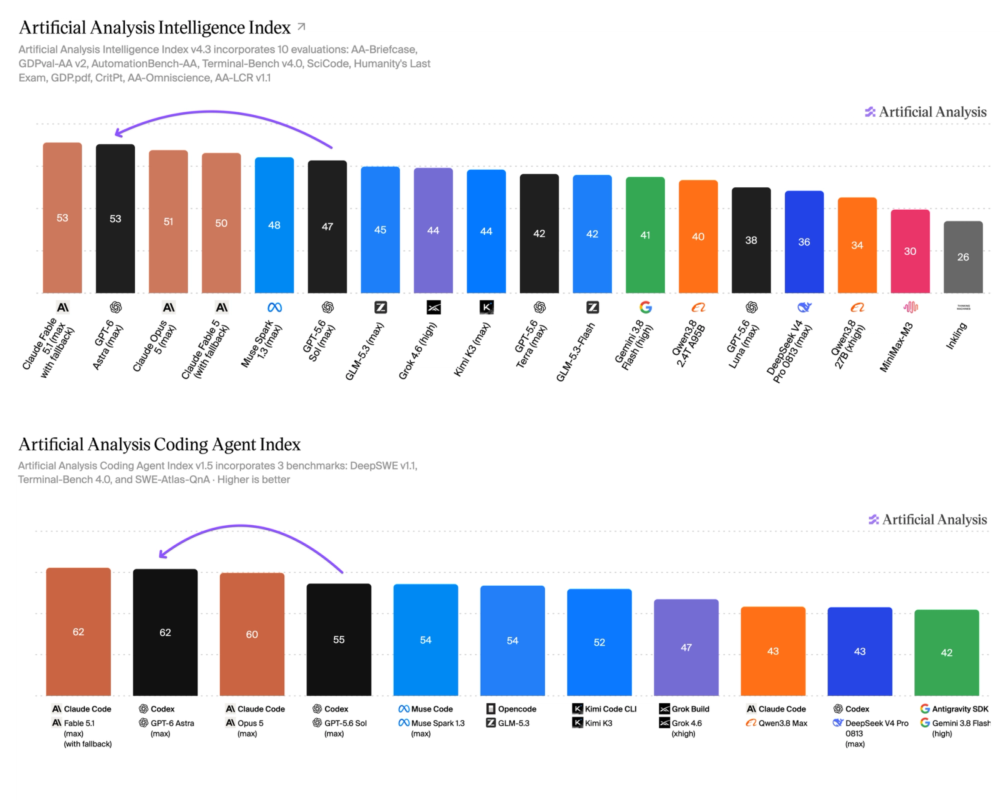
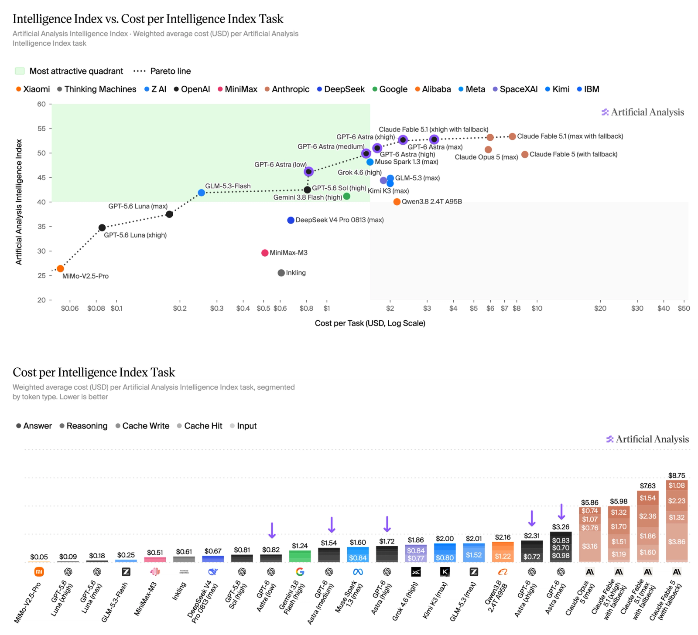
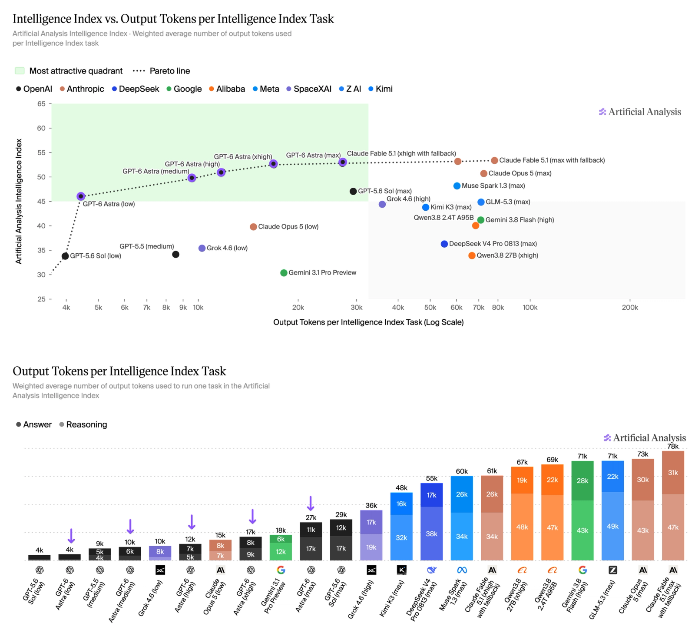
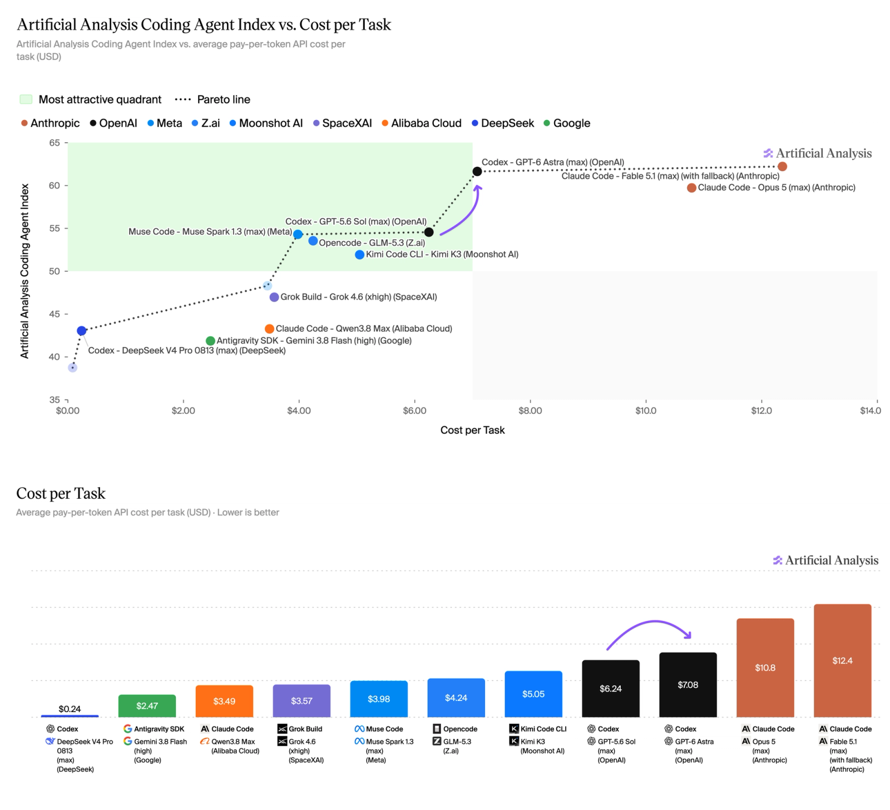
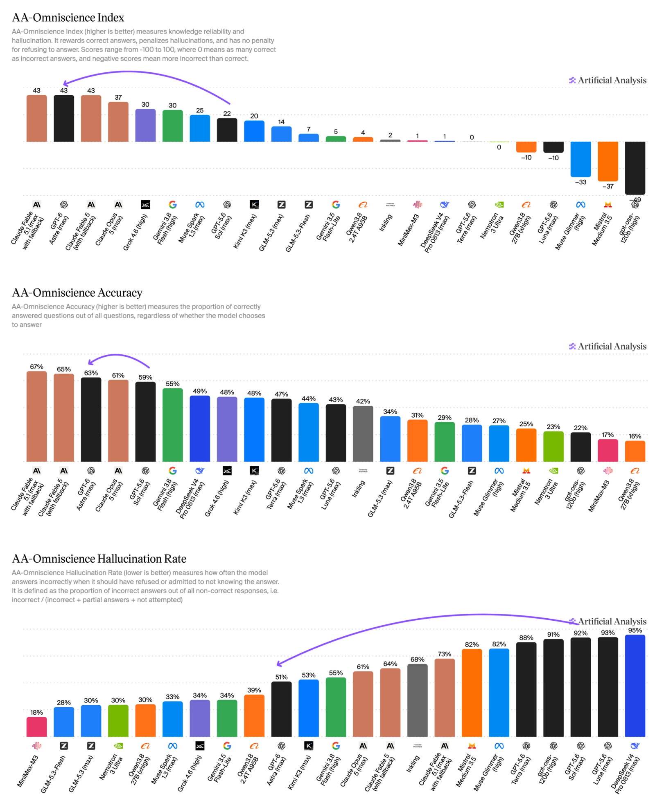
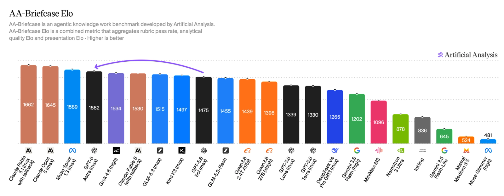
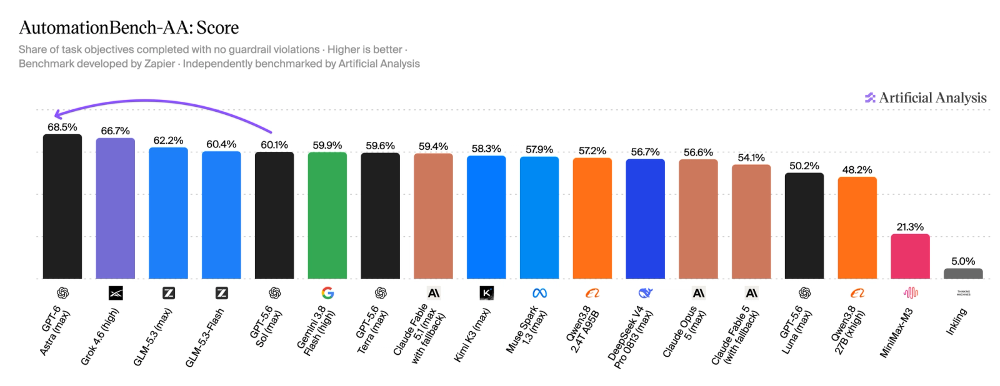
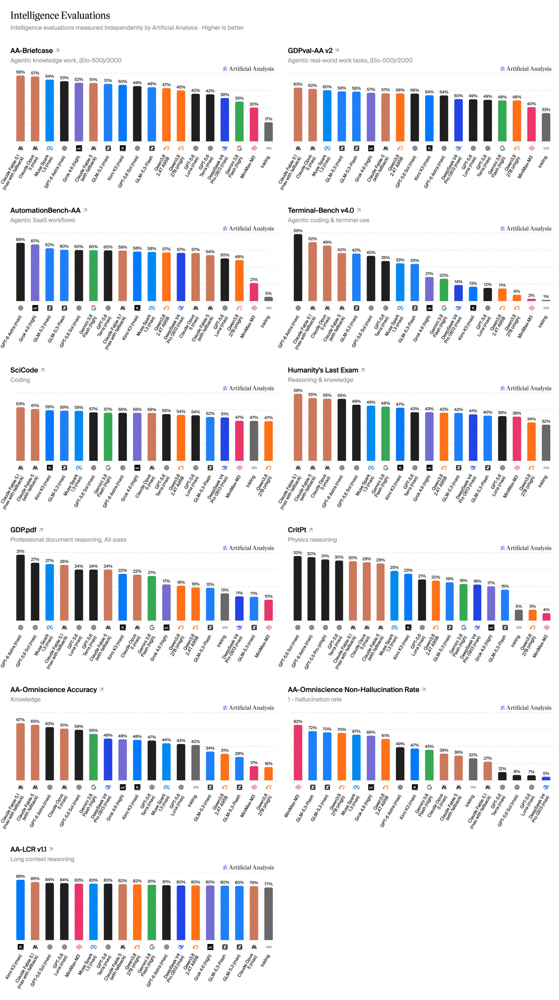

> **In here:** GPT-6 Astra vs Claude Fable 5.1 on Intelligence Index and Coding Agent Index · cost and token-efficiency frontiers · AA-Omniscience, AA-Briefcase, Terminal-Bench, AutomationBench-AA, GDPval-AA v2 results

# Benchmarking GPT-6 Astra

**GPT-6 Astra ties leadership with Claude Fable 5.1 in both of our flagship Indices, at lower cost. Astra equals Fable 5.1 in the Intelligence Index at ~40% of the cost, and in the Coding Agent Index at ~60% of the cost.**

Pricing is 2.5x GPT-5.6 Sol’s current prices across the board, up from $4/$20 to $10/$50 per million input/output tokens, with the same 90% discount for cache reads and 25% premium for cache writes.

In the Artificial Analysis Intelligence Index, GPT-6 Astra ties Claude Fable 5.1 at ~40% of the cost per task, gaining 6 points on GPT-5.6 Sol. In the Artificial Analysis Coding Agent Index, it ties Claude Fable 5.1 at ~60% of the cost per task, driven by the lowest token use of any agent in the Index.

**Artificial Analysis Intelligence Index - key takeaways:**

**➤ Ties for first place in the Intelligence Index:** GPT-6 Astra (max) scores 53 in the Index, level with Claude Fable 5.1 (max with fallback). It gains 6 points on its predecessor, GPT-5.6 Sol (max).

**➤ Occupies much of the cost frontier:** Every Astra reasoning effort level sits on the Intelligence Index vs Cost per Task frontier. Against Claude Fable 5.1 (max with fallback), Astra matches the score at ~40% of the cost per task ($3.26 vs $7.63). At max effort, Astra is ~60% more expensive than GPT-5.6 Sol. The higher price per token is partially offset by lower token use.

**➤ Defines the token efficiency Pareto frontier:** All reasoning efforts from low to max sit on the Pareto frontier for Intelligence Index vs Output Tokens per Task. At max effort, Astra uses 27k output tokens per task, about a third of Claude Fable 5.1 (max with fallback) at 78k, for the same score.

**➤ Hallucinates half as much as GPT-5.6 Sol:** GPT-6 Astra sees a large jump in AA-Omniscience, our knowledge and hallucination benchmark. This is driven by a significant decrease in hallucination rate from 92% to 51% at max effort. Unlike some models, this improvement does not come at the cost of accuracy - Astra increased accuracy by 4 points at the same time.

**➤ ~90 point gain in AA-Briefcase Elo:** GPT-6 Astra improves ~90 points in AA-Briefcase, our frontier long-horizon knowledge work evaluation. Models are tested on multi-week projects, with many linked tasks and thousands of source files. Astra sees a significant increase in both rubric scores and Analytical Quality Elo in AA-Briefcase compared to its predecessor. In the other direction, we observe a reduction in Presentation Quality Elo, where GPT-5.6 Sol (max) still leads all models.

**➤ Leads Terminal-Bench v4.0, AutomationBench-AA and GDP.pdf:** GPT-6 Astra scores 59% on Terminal-Bench v4.0, ahead of Claude Fable 5.1 (52%) and 19 points ahead of GPT-5.6 Sol (40%). It scores 69% on AutomationBench-AA, our implementation of Zapier’s business workflow benchmark, ahead of Grok 4.6 (67%) and GPT-5.6 Sol (60%). On GDP.pdf, which tests reasoning over professional documents, it passes every criterion on 31% of attempts against 27% for GPT-5.6 Sol.

**➤ Reduced performance in GDPval-AA v2:** Compared to GPT-5.6 Sol, we observe a drop of ~45 Elo points in GDPval-AA v2 - a benchmark we adapted from OpenAI’s dataset measuring economically valuable tasks across 44 occupations. We observed GPT-6 Astra using significantly fewer turns than other models in GDPval tasks - 24 per task at max effort, compared to 45 for GPT-5.6 Sol and 60 turns per task for Claude Fable 5.1 and Claude Opus 5.

**Artificial Analysis Coding Agent Index - key takeaways:**

**➤ Ties for first place in the Coding Agent Index:** In Codex, GPT-6 Astra scores 62 in the Index, level with Claude Fable 5.1 in Claude Code (62) and ahead of Claude Opus 5 (60), GPT-5.6 Sol (55) and Muse Spark 1.3 in Muse Code (54). Its 7 point lead over GPT-5.6 Sol comes from Terminal-Bench v4.0 (56% vs 37%) and SWE-Atlas-QnA (62% vs 54%), partly offset by a lower score on DeepSWE (68% vs 72%).

**➤ On the Coding Agent Index cost frontier:** At max effort, GPT-6 Astra costs $7.09 per task, ~15% more than GPT-5.6 Sol (max) for a 7 point higher score. Per task, the model is ~40% cheaper than Claude Fable 5.1 (max with fallback) and ~30% cheaper than Claude Opus 5 (max), for the same or higher score. Astra’s cost efficiency is driven by token efficiency gains: at max effort, it uses one third of the tokens of GPT-5.6 Sol per task.

Every reasoning effort of GPT-6 Astra sits on the Intelligence Index vs Cost per Task frontier, from low at $0.82 per task to max at $3.26. Against Claude Fable 5.1 (max with fallback), Astra matches the score at ~40% of the cost per task.

GPT-6 Astra defines the Pareto frontier for Intelligence Index vs Output Tokens per Task. Every reasoning effort from low to max sits on the frontier, and at max effort Astra uses about a third of the output tokens of Claude Fable 5.1 (max with fallback) for the same score.

GPT-6 Astra is on the Pareto frontier for Coding Agent Index vs Cost per Task. At max effort it costs $7.09 per task, ~15% more than GPT-5.6 Sol (max) for a 7 point higher score, and ~40% less than Claude Fable 5.1 (max with fallback) in Claude Code for the same score.

GPT-6 Astra sees a large jump in AA-Omniscience, driven by a significant decrease in hallucination rate from 92% to 51% at max effort, alongside a modest increase in accuracy.

GPT-6 Astra scores ~90 Elo points above GPT-5.6 Sol in AA-Briefcase, our frontier long-horizon knowledge work evaluation. Astra sees a significant increase in both rubric scores and Analytical Quality Elo compared to its predecessor, but a reduction in Presentation Quality Elo, where GPT-5.6 Sol (max) still leads all models.

GPT-6 Astra leads AutomationBench-AA, our implementation of Zapier’s business workflow benchmark, at 69%, ahead of Grok 4.6 (67%), GLM-5.3 (62%) and GPT-5.6 Sol (60%).

Breakdown of the individual evaluations in the Artificial Analysis Intelligence Index.

Compare GPT-6 Astra with other leading models at: [www.artificialanalysis.ai](http://www.artificialanalysis.ai)
