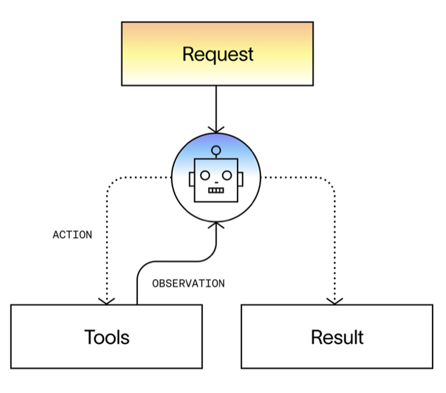
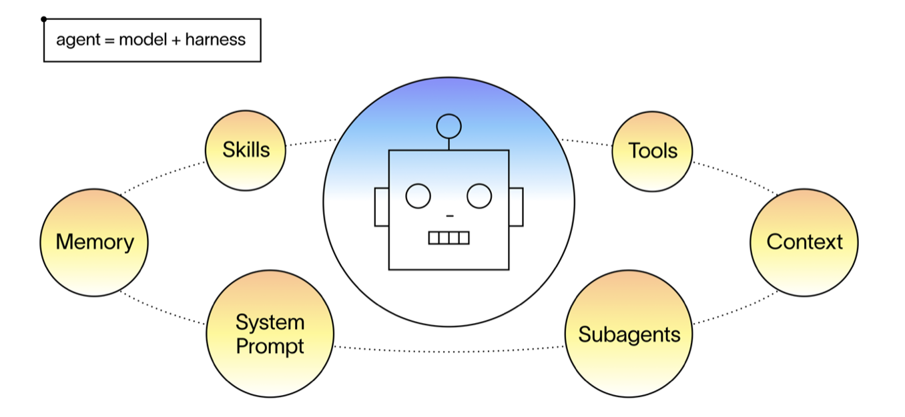
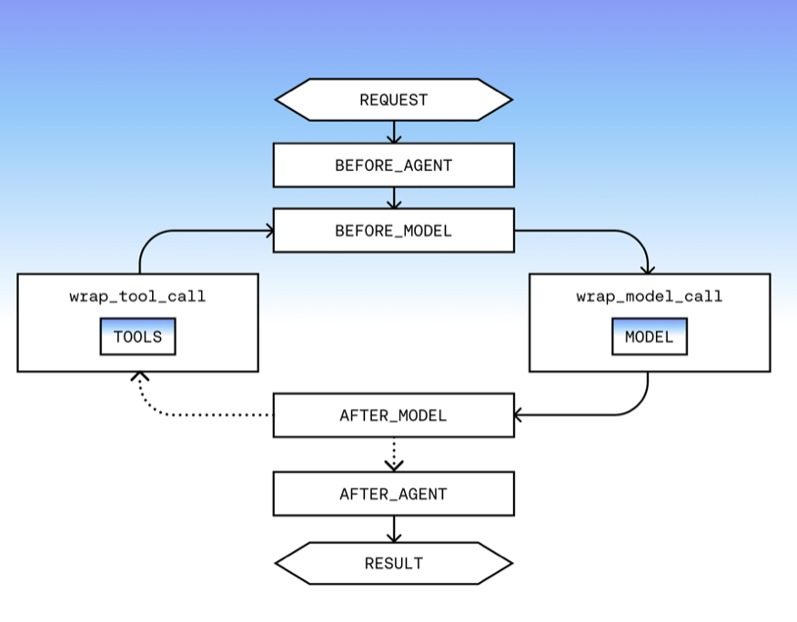

> **In here:** agent = model + harness · `create_agent` and middleware as the customization primitive · mapping middleware to harness capabilities and task-harness fit.

# How to Build a Custom Agent Harness

_By Sydney Runkle — June 3, 2026 — 6 min read_

## Key Takeaways

- A harness is the scaffolding around the model that connects it to the real world.
- How well a harness fits the task at hand determines how useful an agent is.
- LangChain's `create_agent` is the easiest way to build a custom harness tailored to a given task.

Building useful agents is largely about *customization:* connecting your agent to the right context, data, and environment(s) for the task at hand.

At its core, an agent is a model calling tools in a loop until it completes a task and returns a result:



You can also define an agent as:

> agent = model + harness

The harness is the scaffolding around the model that connects it to the real world.



The remainder of this post assumes the following:

1. An agent is only as good as the context provided to the model
2. The job of a harness is to provide context to the model at every step

So, to build a useful agent, you need a harness that's great at delivering the right context for the given task to the model.

## The base harness

`create_agent` is LangChain's primitive for building a harness. Pass in a model, tools, and a system prompt, and you have a working agent:

```python
from langchain.agents import create_agent

agent = create_agent(
    model="anthropic:claude-sonnet-4-6",
    tools=tools,
    system_prompt="you are a helpful assistant..."
)
```

Harnesses like [Deep Agents](https://docs.langchain.com/oss/python/deepagents/overview) and the [Claude Agent SDK](https://code.claude.com/docs/en/agent-sdk/overview) come pre-assembled with an opinionated middleware (explained below) stack: memory, context management, sandboxing, and more. They're designed to get you to a production-ready agent fast, and they work well for most cases. But many agents need finer grained customization than these harnesses support: custom prompting, business logic, guardrails, etc.

`create_agent` takes a different approach: it's *purposefully minimalistic*. Our philosophy is similar to that of [Pi](https://pi.dev/), a highly configurable coding agent harness. `create_agent` just implements the core agent loop, and it exposes **middleware** as a primitive for customization.

## Middleware: how you customize the harness

Middleware hooks into the agent loop at each step: before and after model calls, before and after tool calls, at agent startup and teardown. Each piece handles one concern and composes freely with any other:



Middleware allows you to add **capabilities** to your agent via a few levers that often work together:

**Deterministic Logic.** Business logic, policy enforcement, dynamic agent control — anything that needs to fire at a specific point in the loop. This includes runtime control over the agent itself: swapping the model based on task complexity, adjusting the prompt, and updating the agent's message history (during compaction, for example). The right place for anything that can't (or shouldn't) live in a prompt.

**Tools.** Rather than registering tools directly on the agent, middleware can handle the full lifecycle — setup, teardown, registration — and hand the agent a clean set of tools to work with. This matters when tools have dependencies, require initialization, or need to be torn down cleanly at the end of a run. It also keeps tool configuration close to the logic that governs it, rather than scattered across the agent definition.

**Custom state.** If your middleware needs to track state across hooks, middleware can extend the agent's state with custom properties. This enables middleware to track state throughout execution (maintain counters, flags, or other values that persist throughout agent runs) and share data between hooks.

**Stream handlers.** Middleware can intercept and transform the agent's output stream — filtering events, injecting metadata, routing different event types to different consumers. Useful when different parts of your stack need to react to different things the agent does: a UI consuming token deltas, an audit log capturing tool calls, a monitoring system tracking latency.

The beauty of middleware is that it:

1. Enables customization at any point in the agent loop
2. Bundles related logic in composable, sharable units of code

LangChain ships [prebuilt middleware](https://docs.langchain.com/oss/python/langchain/middleware/built-in) for the most common patterns. Anything bespoke to your use case is one [custom middleware](https://docs.langchain.com/oss/python/langchain/middleware/custom) away. Because each piece is isolated, the same middleware can be reused across every agent in an organization so that new agents inherit battle-tested behavior without rebuilding it.

## Harness capabilities

The job of a harness is to get the model the right context at the right time for the given task.

The table below maps common capabilities to middleware that support them. Most production agents end up using several together, depending on the agent's needs (is it long running? how complex are the tasks? how sensitive are the agent's actions?, etc):

| Capability | Why it Matters | Middleware |
| --- | --- | --- |
| Prevent context overflow | Long-running sessions accumulate message history fast. Without intervention, it overflows the context window. | SummarizationMiddleware, ContextEditingMiddleware |
| Access and update memory | Load relevant knowledge at startup, write it back at the end of a run. Lets the agent improve over time from real usage. | FilesystemMiddleware, MemoryMiddleware, SkillsMiddleware |
| Take actions in an environment | A fixed toolset limits what an agent can do. Access to a filesystem and execution environment unlocks more creative solutions, often with greater token efficiency. | ShellToolMiddleware, FilesystemMiddleware, CodeInterpreterMiddleware |
| Delegate tasks | Subagents handle complex sub-tasks with clean context windows. A todo list tracks progress across a long run. | SubAgentMiddleware, AsyncSubAgentMiddleware, TodoListMiddleware |
| Handle transient failures | Models and tools fail unpredictably. Production agents need retry logic with backoff and fallbacks when a model is unavailable. | ToolRetryMiddleware, ModelRetryMiddleware, ModelFallbackMiddleware |
| Enforce policies | PII handling, compliance checks, approval gates — these need to fire on every call regardless of what the model does. They don't belong in a prompt. | PIIMiddleware, HumanInTheLoopMiddleware |
| Steer the agent | Full autonomy isn't always appropriate. Pause before consequential actions and wait for a human to approve, reject, or redirect. | HumanInTheLoopMiddleware |
| Control costs | Prompt caching reduces token spend on long-running tasks. Call limits prevent costs from accumulating unchecked. | ModelCallLimitMiddleware, ToolCallLimitMiddleware, PromptCachingMiddleware |

See the [full list of prebuilt middleware](https://docs.langchain.com/oss/python/langchain/middleware/built-in).

## Task-harness fit

Task-harness fit is how well your harness matches the actual demands of the task: the context it needs, the failures it'll encounter, the policies it must enforce, the environment it operates in. A harness for a customer service agent looks very different from one built for a long-running coding agent.

Every agent we build at LangChain, including our [GTM agent](https://www.langchain.com/blog/how-we-built-langchains-gtm-agent), [asynchronous coding agent](https://github.com/langchain-ai/open-swe), and our [no-code agent builder](https://www.langchain.com/langsmith/fleet), is built on `create_agent` with a middleware stack tailored to that agent's mission.

The best agents aren't just built with capable models, they're built with harnesses that tightly fit the task. The easiest way to build a custom harness is with `create_agent`.

## References

### Get Started

- [Quickstart: build your first agent with `create_agent`](https://docs.langchain.com/oss/python/langchain/quickstart)
- [`create_agent` guide](https://docs.langchain.com/oss/python/langchain/agents)
- [Middleware reference](https://docs.langchain.com/oss/python/langchain/middleware/built-in)
- [Custom middleware guide](https://docs.langchain.com/oss/python/langchain/middleware/custom)
- [Deep Agents: a production harness built on `create_agent`](https://docs.langchain.com/oss/python/deepagents/overview)

### Acknowledgements

Thanks to [@hwchase17](https://x.com/@hwchase17), [@huntlovell](https://x.com/@huntlovell), [@masondrxy](https://x.com/@masondrxy), and [@Vtrivedy10](https://x.com/@Vtrivedy10) for their thoughtful review and feedback.
