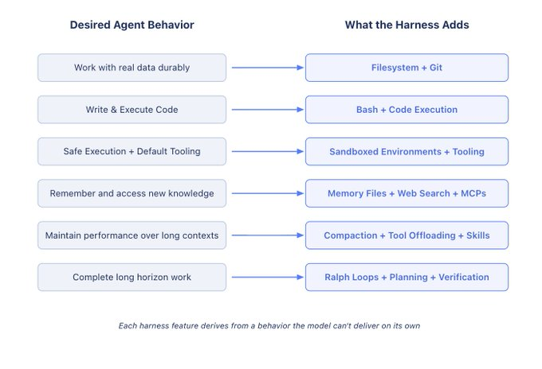
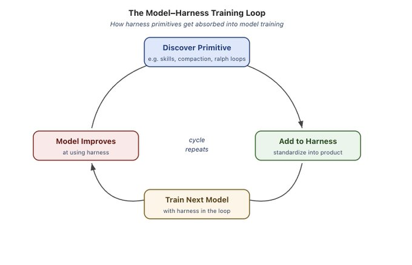

> **In here:** what a harness is (everything beyond the model) · harness primitives (filesystem, bash, sandboxes, memory, context management) · long-horizon autonomy and the future of harness engineering

# The Anatomy of an Agent Harness

**By Vivek Trivedy | March 10, 2026 | 12 min read**

## Key Takeaways

- **Break down complex objectives:** Planning tools let agents decompose tasks, track progress, and adapt as they learn
- **Delegate work in parallel:** Spawn subagents for independent subtasks, each with isolated context

**TLDR:** Agent = Model + Harness. Harness engineering is how we build systems around models to turn them into work engines. The model contains the intelligence and the harness makes that intelligence useful.

## Can Someone Please Define a "Harness"?

**If you're not the model, you're the harness.**

A harness encompasses every piece of code, configuration, and execution logic beyond the model itself. A raw model isn't an agent until a harness provides elements like state, tool execution, feedback loops, and enforceable constraints.

Concretely, a harness includes:

- System Prompts
- Tools, Skills, MCPs and their descriptions
- Bundled Infrastructure (filesystem, sandbox, browser)
- Orchestration Logic (subagent spawning, handoffs, model routing)
- Hooks/Middleware for deterministic execution (compaction, continuation, lint checks)

This definition forces us to think about "designing systems around model intelligence."

## Why Do We Need Harnesses: From a Model's Perspective

Models take in data like text, images, audio, and video and output text. Out of the box they cannot:

- Maintain durable state across interactions
- Execute code
- Access realtime knowledge
- Setup environments and install packages to complete work

These are all **harness level features**. To create a conversational experience, we wrap the model in a while loop to track previous messages and append new user messages. The main idea is converting desired agent behavior into actual harness features.

## Working Backwards from Desired Agent Behavior to Harness Engineering

Harness Engineering helps humans inject useful priors to guide agent behavior. As models have grown more capable, harnesses surgically extend and correct models to complete previously impossible tasks.

The pattern followed is:

**Behavior we want (or want to fix) → Harness Design to help the model achieve this.**

## Filesystems for Durable Storage and Context Management

Agents need durable storage to interface with real data, offload information beyond context limits, and persist work across sessions.

Models operate only on knowledge within their context window. The natural solution became:

**Harnesses ship with filesystem abstractions and tools for fs-ops.**

The filesystem is arguably the most foundational harness primitive because it unlocks:

- Agents get a workspace to read data, code, and documentation
- Work can be incrementally added and offloaded instead of holding everything in context
- **The filesystem is a natural collaboration surface.** Multiple agents and humans coordinate through shared files

Git adds versioning so agents can track work, rollback errors, and branch experiments.

## Bash + Code as a General Purpose Tool

Agents need to solve problems autonomously without humans pre-designing every tool.

The main execution pattern is a ReAct loop, where a model reasons, takes action via a tool call, observes results, and repeats. Instead of forcing users to build tools for every possible action:

**Harnesses ship with a bash tool so models can solve problems autonomously by writing & executing code.**

This gives models a computer and lets them figure out the rest autonomously. The model can design its own tools on the fly via code instead of being constrained to pre-configured tools.

## Sandboxes and Tools to Execute & Verify Work

Agents need an environment with the right defaults to safely act, observe results, and make progress.

**Sandboxes give agents safe operating environments.** Instead of executing locally, the harness connects to a sandbox to run code, inspect files, install dependencies, and complete tasks. This creates secure, isolated execution.

Harnesses can allow-list commands and enforce network isolation. Sandboxes also unlock scale because environments can be created on demand, fanned out across many tasks, and torn down when work is done.

**Good environments come with good default tooling.** Harnesses configure tooling so agents can do useful work, including:

- Pre-installed language runtimes and packages
- CLIs for git and testing
- Browsers for web interaction and verification

Tools like browsers, logs, screenshots, and test runners help agents observe and analyze their work. This creates **self-verification loops where** agents can **write application code,** run tests, inspect logs, and fix errors.

## Memory & Search for Continual Learning

Agents should remember what they've seen and access information that didn't exist when trained.

Models only have knowledge from their weights and current context. The only way to "add knowledge" is via **context injection.**

For memory, the filesystem is again a core primitive. Harnesses support memory file standards like AGENTS.md which get injected into context on agent start. As agents edit this file, harnesses load the updated file into context. This is a form of continual learning where agents durably store knowledge from one session and inject that knowledge into future sessions.

For up-to-date knowledge, Web Search and MCP tools help agents access information beyond the knowledge cutoff like new library versions or current data.

## Battling Context Rot

Agent performance shouldn't degrade over the course of work.

Context Rot describes how models become worse at reasoning and completing tasks as their context window fills up. Context is a precious and scarce resource, so harnesses need strategies to manage it.

**Harnesses today are largely delivery mechanisms for good context engineering.**

**Compaction** addresses what happens when the context window is close to filling up. The harness uses some strategy to intelligently offload and summarize existing context so the agent can continue working.

**Tool call offloading** reduces the impact of large tool outputs that clutter context without providing useful information. The harness keeps the head and tail tokens of tool outputs above a threshold and offloads the full output to the filesystem.

**Skills** address having too many tools or MCP servers loaded into context on agent start. Skills solve this via **progressive disclosure**, protecting the model against context rot.

## Long Horizon Autonomous Execution

Agents need to complete complex work autonomously and correctly over long time horizons.

Autonomous software creation requires durable state, planning, observation, and verification to keep working across multiple context windows.

**Filesystems and git for tracking work across sessions.** Agents produce millions of tokens over long tasks so the filesystem durably captures work to track progress. Git allows new agents to quickly get up to speed on the latest work and history.

**Ralph Loops for continuing work.** The Ralph Loop is a harness pattern that intercepts the model's exit attempt via a hook and reinjects the original prompt in a clean context window, forcing the agent to continue its work against a completion goal.

**Planning and self-verification to stay on track.** Planning is when a model decomposes a goal into a series of steps. Harnesses support this via good prompting and injecting reminders how to use a plan file. After completing each step, agents benefit from checking the correctness of their work via **self-verification.** Verification grounds solutions in tests and creates a feedback signal for self-improvement.

## The Future of Harnesses

### The Coupling of Model Training and Harness Design

Today's agent products like Claude Code are post-trained with models and harnesses in the loop. This helps models improve at actions the harness designers think they should be natively good at like filesystem operations, bash execution, planning, or parallelizing work with subagents.

This creates a feedback loop. Useful primitives are discovered, added to the harness, and then used when training the next generation of models.

**But this doesn't mean that the best harness for your task is the one a model was post-trained with.** The Terminal Bench 2.0 Leaderboard shows examples where Opus 4.6 scores differently depending on the harness. There's significant value to be gained by optimizing the harness for your task.

### Where Harness Engineering is Going

As models get more capable, some of what lives in the harness today will get absorbed into the model. Models will get better at planning, self-verification, and long horizon coherence natively.

Just as prompt engineering continues to be valuable today, harness engineering will likely continue to be useful for building good agents.

Harnesses today patch over model deficiencies, but they also engineer systems around model intelligence to make them more effective. A well-configured environment, the right tools, durable state, and verification loops make any model more efficient.

Harness engineering is an active research area explored through the deepagents library at LangChain. Open and interesting problems include:

- Orchestrating hundreds of agents working in parallel on a shared codebase
- Agents that analyze their own traces to identify and fix harness-level failure modes
- Harnesses that dynamically assemble the right tools and context just-in-time for a given task instead of being pre-configured

**The model contains the intelligence and the harness is the system that makes that intelligence useful.**
