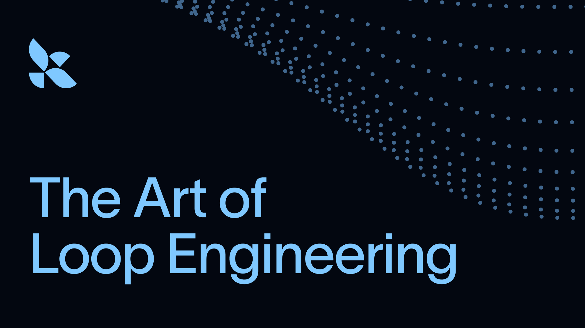
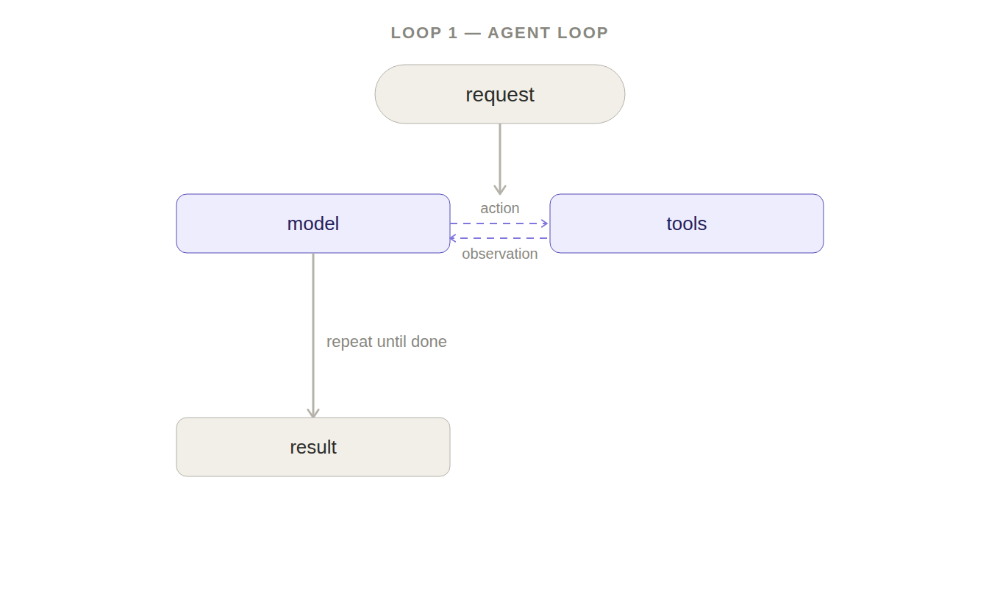
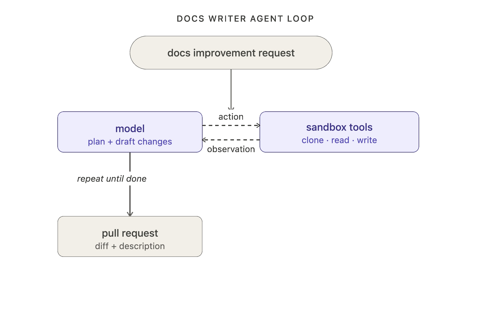
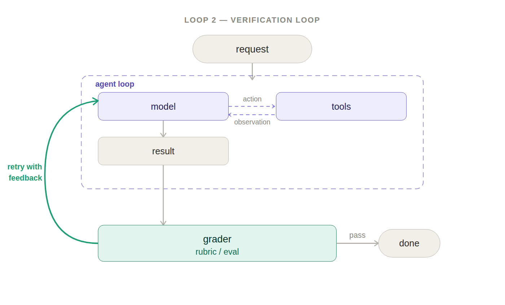
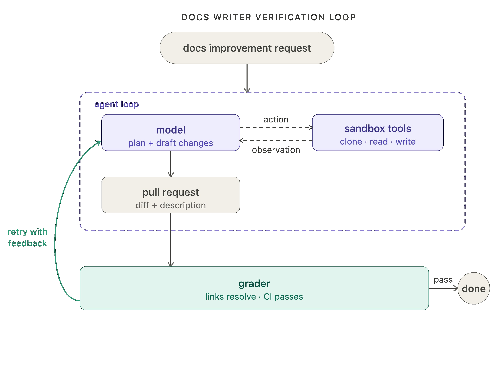
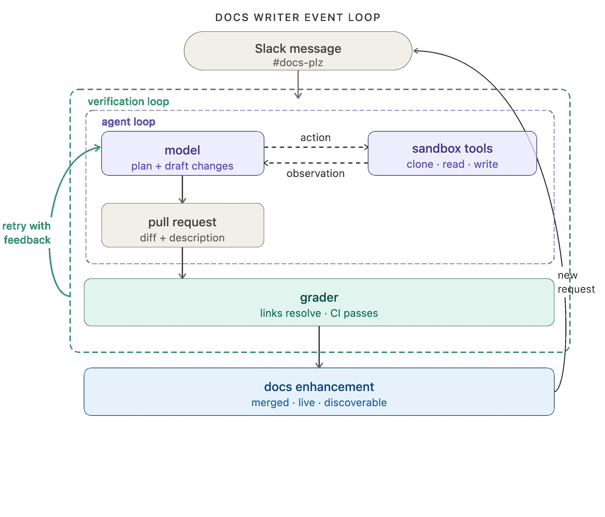
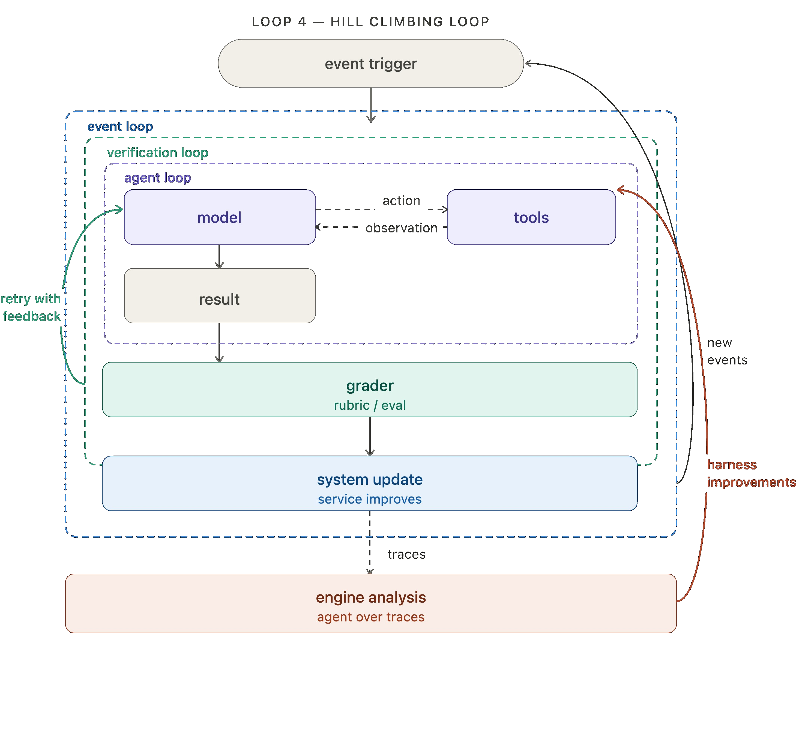
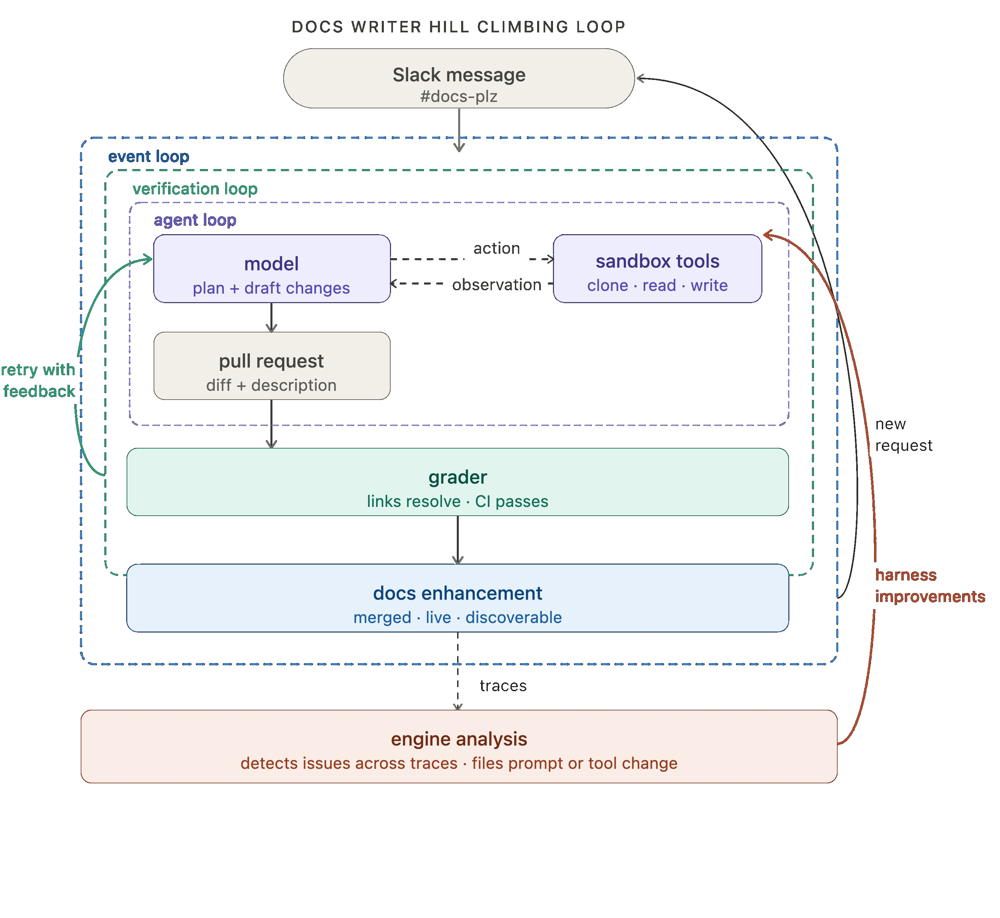

> **In here:** the four-loop stack (agent, verification, event-driven, hill climbing) · LangChain primitives for each loop · human oversight points and why loop engineering matters strategically.

Agents are useful because they help us automate work by taking actions in the real world. But getting agents to do valuable work reliably takes more than just a good model: it requires a carefully designed harness that's fit to a set of tasks.

The core agent algorithm is simple: give the LLM context and let it call tools in a loop until it's done. This is the most fundamental loop. But it's far from the only loop that powers agents. [Swyx](https://x.com/swyx) recently wrote a great piece on ["loopcraft: the art of stacking loops"](https://www.latent.space/p/ainews-loopcraft-the-art-of-stacking), the idea that you can stack and extend loops to build more effective agents.

Here's how we think about that stack, and how to instrument each level with LangChain primitives.

## Loop 1: The Agent

At its core, an agent is just a model calling tools in a loop until a task is complete.

This is what LangChain's [`create_agent`](https://docs.langchain.com/oss/python/langchain/agents) gives you. Pick any model, plug in tools, and you have a working agent loop. [Tools](https://docs.langchain.com/oss/langchain/tools) are what give the agent the power to take action in the real world.

Take our internal docs agent as an example (which we'll use as a motivating example for the rest of this blog). At the first loop level, it receives a request for a documentation improvement, the model plans and draft changes, and it uses tools to clone repos, read files, write docs, open a pull request, etc.

## Level 2: Verification loop

The agent loop gets work done, but it doesn't always produce correct or consistent work on the first pass. When consistency matters, it's often useful to wrap it in a verification loop that checks the output and sends feedback back to the model when it falls short.

The verification loop adds a grader: something that checks the agent's output against a rubric and, if it fails, sends the result back with feedback. Graders can either be deterministic or agentic ([LLM as a judge](https://docs.langchain.com/langsmith/llm-as-judge) is a classic example, here).

[`RubricMiddleware`](https://docs.langchain.com/oss/python/deepagents/rubric) handles this pattern, or you can wire it up with an [`after_agent` hook](https://docs.langchain.com/oss/langchain/middleware/overview) on `create_agent`.

For our docs writer example, the grader runs tests after each attempt, checking that all links resolve, all CI checks pass, and the diff is scoped to what was actually requested. No manual review needed to catch those classes of error.

One tradeoff: adding verification increases latency and cost per run. It's worth it when quality matters more than speed, which is most production use cases.

## Level 3: Event driven loop

One of the most important parts of agent development is the integrations layer: connecting your agent to your ecosystem so that it can run in the background.

The event-driven loop connects your agent to your ecosystem. An event fires — a new document lands, a schedule triggers, a webhook arrives — and the agent runs. The agent isn't something you invoke manually; it's a component running continuously inside a larger system.

[LangSmith Deployment](https://info.langchain.com/agent-development-platform?utm_campaign=evergreen_agent_development_platform_cv&utm_campaign_id=23761370321&utm_ad_group_id=195261126163&utm_ad_id=805594028616&utm_network=g&utm_term=ai%20agent%20development%20platform&utm_campaign=evergreen_agents_cv&utm_source=google&utm_medium=cpc&hsa_acc=7906965105&hsa_cam=23761370321&hsa_grp=195261126163&hsa_ad=805594028616&hsa_src=g&hsa_tgt=kwd-2392721013549&hsa_kw=ai%20agent%20development%20platform&hsa_mt=p&hsa_net=adwords&hsa_ver=3&gad_source=1&gad_campaignid=23761370321&gbraid=0AAAAA-PkievTcIb-6awevyQxCB-9n-H6Z&gclid=CjwKCAjwxb7RBhA5EiwAQ-AAdF5XHKtTYLgQVrVYstdxYjTd0hcrCuqxvuACiKzOOdxcJdTza8HkwxoCDiQQAvD_BwE) supports the trigger infrastructure, including support for [cron schedules](https://docs.langchain.com/langsmith/cron-jobs) and [webhooks](https://docs.langchain.com/langsmith/use-webhooks). One popular example of crons in action is "heartbeats" in [openclaw](https://docs.openclaw.ai/gateway/heartbeat), which turn your agent into an always-on, proactive assistant.

Our docs agent is powered by [Fleet](https://www.langchain.com/langsmith/fleet), our no-code agent builder. Fleet's [channels](https://docs.langchain.com/langsmith/fleet/channels) and [schedules](https://docs.langchain.com/langsmith/fleet/schedules) handle event-driven and cron-style triggers. We use a channel to fire off the docs agent whenever a message is sent in our `#docs-plz` Slack channel.

## Level 4: Hill climbing loop

The first three loops automate work. The fourth (and arguably most important) automates improvement!

Every agent run [produce a trace](https://docs.langchain.com/langsmith/observability): a record of what the model did, the tools it called, grader feedback, etc. Those traces contain high value signal regarding what's working and what isn't. The hill climbing loop runs an analysis agent over those traces and uses the findings to rewrite the harness with improved configuration. That can include prompt/tool tweaks or grader tweaks.

In LangSmith, you can use [Engine](https://www.langchain.com/langsmith/engine), our trace analysis agent, to instrument this fourth loop.

Wrapping up the docs agent analogy, we run engine over the docs agent traces to detect any issues. When multiple traces signal a potential problem, an issue is filed requesting changes to the offending prompt or tool.

The key move here is that the return arrow doesn't just loop back to the top — it reaches inside and updates the agent loop directly. Each cycle of the outer loop makes the inner loops more effective.

**Looking forward:** prompt and tool configuration are the most simple things to improve, but they're not the only options. For teams running open-weight models, the hill climbing loop can feed into RL fine-tuning, using trace or eval outcomes as training signal to improve the model itself. Auxiliary context like memory and retrieved skills can be improved the same way. The loop is the pattern; what it optimizes is up to you.

## Human oversight and expertise

Automation doesn't mean removing humans from the loop. At every level, there are natural points where human oversight adds value. An automated grader can check whether links resolve; it takes a human to notice the framing is wrong for the audience. That kind of judgment, earned from context, experience, and taste, is exactly where human review earns its place.

Some expertise should be codified in the prompt/tools themselves, but for sensitive actions, live human review is essential (think financial transactions, DB operations, etc). LangChain makes it straightforward to instrument these touch points in every loop:

1. In the agent loop, [require human input](https://docs.langchain.com/oss/langchain/human-in-the-loop) before sensitive actions/tool calls
2. In the verification loop, a human can act as the grader for sensitive workflows
3. In the application loop, a human can approve outputs before they're returned to the end user
4. In the hill climbing loop, harness improvements can flow through human review before deployment

All of LangChain's open source frameworks make adding a "human in the loop" a [first class primitive](https://docs.langchain.com/oss/python/deepagents/human-in-the-loop).

## Putting it all together

In case you'd prefer a more tabular view, here's how those four loops stack together:

| Loop | What it does | Impact | LangChain primitive |
| --- | --- | --- | --- |
| 1. Agent loop | Model calls tools repeatedly until a task is complete | Automate work | create_agent, any LangChain-supported model |
| 2. Verification loop | Agent runs, output is scored against a rubric, retried with feedback if it fails | Ensure work quality and correctness | RubricMiddleware |
| 3. Event driven loop | Events trigger agent runs that update a real system | Automated work at scale | LangSmith Deployment with cron triggers / webhooks or Fleet channels |
| 4. Hill climbing loop | Traces from production runs feed an analysis agent that improves the harness config | Harness improvements | LangSmith Engine |

This is what loop engineering — or [loopcraft](https://www.latent.space/p/ainews-loopcraft-the-art-of-stacking), as swyx puts it — actually looks like in practice. AI leaders like [Steipete](https://x.com/steipete/status/2063697162748260627), [Boris](https://x.com/0xwhrrari/status/2064804504608887040), and [Andrej](https://www.youtube.com/watch?v=kwSVtQ7dziU) have all arrived at the same conclusion: the potential in agents is in the loops you build around them.

We've been thinking about loops 1 and 2 for a while. But focus should pivot to loops 3 and 4 where value compounds by embedding agents into your ecosystem that continuously improve in response to your criteria.

Satya [frames the organizational stakes](https://x.com/satyanadella/status/2066182223213293753): companies that build learning loops early, where human judgment and token capital compound together, will build an advantage that's hard to replicate.

## Acknowledgements

Thanks to [Vivek](https://x.com/Vtrivedy10), [Mason](https://x.com/masondrxy), [Harrison](https://x.com/hwchase17?lang=en), and [Hunter](https://x.com/huntlovell) for thoughtful review.

## Reference

- [deepagents quickstart](https://docs.langchain.com/oss/python/deepagents/quickstart)
- [create_agent docs](https://docs.langchain.com/oss/python/langchain/agents)
- [rubric middleware](https://docs.langchain.com/oss/python/deepagents/rubric)
- [cron jobs](https://docs.langchain.com/langsmith/cron-jobs), [webhooks](https://docs.langchain.com/langsmith/use-webhooks)
- [langsmith engine](https://www.langchain.com/langsmith/engine)
- [fleet channels](https://docs.langchain.com/langsmith/fleet/channels)
