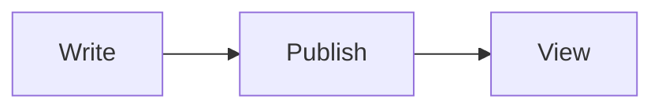

# Markdown Lane

A paragraph with **strong**, *emphasis*, `code`, and a [link](https://example.com).

- [x] a finished task
- [ ] an open task

| Light | Aperture | EV |
| :--- | ---: | :-: |
| Bright sun | f/16 | 15 |

> A blockquote.

Raw HTML should not pass through: <b onclick="alert(1)">bold</b> 
